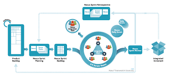

# Eng130_Week 1
### What is a Devops?
- DevOps is a set of practices that combines software development (Dev) and IT operations (Ops). It aims to shorten the systems development life cycle and provide continuous delivery with high software quality.

### What is the role of a devops
- The role of a devOps engineer combines aspects of a technical role and an IT operations role. While engineers are likely to be involved with coding, and a knowledge of coding languages and principles is required to find problems and build solutions, this is not the primary role of a devOps engineer. More senior engineers are likely to be more involved in the project management and planning side of development.

### What are the benefits of a devops
- Faster, better product delivery.
- Greater scalability and availability.
- Better resource utilization
- Introduces automation to the development process.
- Automation in repetitive tasks leaves more room for innovation.
- Promotes agility in your business
- Minimal cost of production.

### What tools are used in devops

- Above shows an image with some of the tools used in devops at each stage of the lifecycle.

### Elevator's Pitch
- An elevator pitch is a brief way of introducing yourself, getting across a key point or two, and making a connection with someone.

### What makes a good elavator pitch
- Create an overview of your good qualities.
- Know your unique selling proposition.
- Think of a creative opening sentence.
- Read the elevator pitch back to yourself out loud.
- Ask a friend of family member to judge your pitch.
- Bring enthusiasm and energy to your pitch.

### What is Agile?
- The Agile methodology is a practice that encourages continuous development and testing throughout the software development lifecycle of a project.
- Agile methodologies attempt to produce the proper product through small cross-functional self-organizing teams that produce small pieces of functionality on a regular basis, allowing for frequent customer input and course correction as needed.

### What is Scrum?

- The Scrum framework is a part of the Agile methodology, which is a practice that involves managing a project by dividing it into multiple phases and repeating a cycle of planning, executing and evaluating at every phase.
- The heart of Scrum is a Sprint, Sprint is one timeboxed iteration of a continuous development cycle. Within a Sprint, planned amount of work has to be completed by the team and made ready for review. Scrum projects are broken down into small and consistent time intervals referred to as sprints. They can be as short as a few days and generally are no longer than 3 – 4 weeks.

### what makes a good presentation?
- Create an easy-to-follow structure
- Limit the amount of text on each slide
- Be savvy with design details
- Polish several times

### How to install pycharm
- To download and install Python, visit the official website of Python https://www.python.org/downloads/ and choose your version. We have chosen Python version 3.6.3
- Once the download is completed, run the .exe file to install Python. Now click on Install Now.
- When it finishes, you can see a screen that says the Setup was successful. Now click on “Close”.

### How to install python
- Download the installer package from Python's official website.
- Wait for the download to complete. Once it's finished, double-click the package to start the installation process. You can follow the on-screen instructions in the Python installer for this step.
- Once the installation is complete, the installer will automatically open Python's installation directory in a new Finder window.

